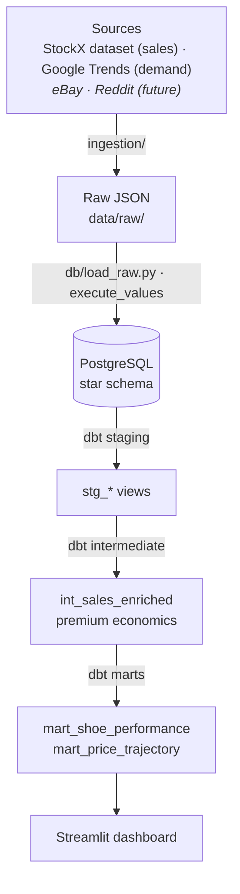

# sneaker-intel

**Sneaker Resale Intelligence Platform.** An end-to-end data engineering project that ingests sneaker resale and demand signals, models them in a warehouse, transforms them with dbt, and surfaces them in a dashboard.

Resale price behavior is hard to reason about from screenshots: why deadstock trades at multiples of retail, how a premium decays after a drop, why two colorways of the same silhouette diverge. This project puts the data in one place so those questions are answerable. It's a personal portfolio project, built in public, with every phase documented through Conventional Commits and a running [DEVLOG](DEVLOG.md). Forecasting resale premium is a deliberate Phase 2 extension and is intentionally out of scope here; this build is the data engineering foundation underneath it.

**Live demo:** not yet deployed (see [DEPLOY.md](DEPLOY.md)). &nbsp;·&nbsp; **CI:** GitHub Actions runs the full pipeline (ingest, load, dbt build and tests) on every push.

## Tech stack

| Layer | Tooling |
|---|---|
| Ingestion | Python (dataclasses, type hints): StockX CSV + `pytrends` (current); `requests`/`praw` clients (future) |
| Storage | PostgreSQL (hand-written star schema, no ORM), `psycopg2` |
| Transformation | dbt-core + dbt-postgres (staging / intermediate / marts) |
| Dashboard | Streamlit + pandas + SQLAlchemy |
| Deployment | Docker, Makefile, GitHub Actions (CI), Railway / Streamlit Cloud |

## Architecture



## Progress

- [x] **Phase 0**: Project scaffold
- [x] **Phase 1**: Python ingestion layer (eBay / Reddit / Google Trends)
- [x] **Phase 2**: Database schema + raw loader (Postgres star schema)
- [x] **Phase 3**: dbt transformation layer (staging / intermediate / marts + tests)
- [x] **Phase 4**: Streamlit dashboard (Market Overview / Shoe Deep Dive / Drop Calendar)
- [x] **Phase 5**: Deployment & polish (Docker, Makefile, CI, deploy guide, README finalize)

## Run locally

Requires Docker (for Postgres) and Python 3.10+.

```bash
# 1. Environment
python3 -m venv .venv && source .venv/bin/activate   # Windows: .venv\Scripts\activate
pip install -r requirements.txt
cp .env.example .env

# 2. Database
make db-up        # start Postgres 16 (Docker)
make db-init      # apply schema.sql + seeds.sql

# 3. Pipeline
make ingest       # fetch sources -> raw JSON in data/raw/ (stub mode without API keys)
make load         # bulk-load raw JSON into Postgres
make transform    # dbt build: models + data tests

# 4. Dashboard
make dashboard    # Streamlit at http://localhost:8501
```

Run `make help` for all targets. To deploy a live instance, see [DEPLOY.md](DEPLOY.md).

## Data sources

The current pipeline has **two sources**, both real and key-free:

| Source | Role | Key needed | Notes |
|---|---|---|---|
| **StockX dataset** (Kaggle) | Real resale sales; the backbone of `fact_sales`, and the loader derives `dim_drops` from it | No (CSV download) | Real Off-White / Yeezy sales: price, retail, release date, size, region |
| **Google Trends** (`pytrends`) | Live search-demand signal per shoe → `fact_search_interest`, shown on the dashboard | No | Public endpoint, no registration |

Everything runs out of the box in **stub mode** (deterministic synthetic
records) so the pipeline, tests, and CI work before you download anything.

### StockX dataset

The dataset ships with the repo at `data/external/StockX-Data-Contest.csv`
(~99K sales), sourced from [Kaggle](https://www.kaggle.com/datasets/hudsonstuck/stockx-data-contest)
and originally released by StockX for their 2019 Data Contest. Point
`STOCKX_CSV_PATH` elsewhere to use a different file. It ingests **every shoe in
the dataset**, and its top-N most-sold shoes become the **watchlist** Google
Trends queries, so search demand joins to the same `dim_shoes` rows as sales.
Tune N with `SNEAKER_INTEL_WATCHLIST_SIZE` (default 15); without the CSV, a
curated default watchlist is used.

## Roadmap / future extensions

These are implemented in the repo (`ingestion/ebay.py`, `ingestion/reddit.py`)
with the same client pattern and tests, and the schema/loader already support
them. They're parked as future work because they require API keys. Enabling
them is additive (add the source back to `run_ingestion`):

| Source | What it adds | What to register | Env vars |
|---|---|---|---|
| eBay (Finding API) | Live sold listings → `fact_sales` (multi-source) | eBay Developer Program **App ID** at https://developer.ebay.com/ | `EBAY_APP_ID` |
| Reddit (`praw`) | Post-level social engagement → `fact_social_posts` | A **script** app at https://www.reddit.com/prefs/apps | `REDDIT_CLIENT_ID`, `REDDIT_CLIENT_SECRET`, `REDDIT_USER_AGENT` |

A further extension, the deliberately deferred **Phase 2 ML** work, would
forecast resale premium from the sales, social, and search features this
warehouse already models.

## Repo layout

```
sneaker-intel/
├── ingestion/        # source clients + run_ingestion entrypoint
├── db/               # hand-written schema.sql
├── dbt_project/      # dbt models (staging / intermediate / marts)
├── dashboard/        # Streamlit app
├── data/raw/         # landed raw JSON (gitignored)
├── docs/             # erd.md, build-in-public posts
├── tests/            # pytest suite
├── .github/workflows # CI
├── DEVLOG.md         # append-only build log
├── Makefile  Dockerfile  docker-compose.yml  requirements.txt  pyproject.toml
```

## Decisions & tradeoffs

**Star schema, hand-written, no ORM.** The warehouse is read-heavy and
analytical (average premium per shoe, demand versus sale volume, which
silhouettes hold value), so a star schema with a conformed `dim_shoes` and
per-source facts keeps those queries to a single dimension join, and it's the
shape dbt and BI tools expect. Writing the DDL by hand keeps the constraints and
indexes explicit and easy to talk through. See [docs/erd.md](docs/erd.md).

**Two social fact tables instead of one.** A Reddit post is one event; Google
Trends is one row per day. Different grains. Splitting them into
`fact_social_posts` and `fact_search_interest` keeps every row meaningful
instead of unioning mismatched grains behind a wall of nulls.

**Idempotency in the schema, not the loader.** Each fact carries a natural-key
unique constraint and the loader inserts `ON CONFLICT DO NOTHING`, so re-running
ingestion is a safe no-op. Resale pulls overlap constantly (the same sold
listing lands in two windows), so this is the property you want before
automating anything.

**Window functions over correlated subqueries.** The price-trajectory mart uses
`AVG() OVER` for the rolling 7-day premium, `RANK() OVER`, and `LAG()`. They
compute in a single pass over each shoe's partition, where the subquery versions
would re-scan per row. Premium decay after a drop only shows up if you can read
each sale against the ones around it, which is exactly what these give you.

**A thin dashboard.** Every figure the Streamlit app shows is a query against a
dbt mart, not pandas transformation. Modeling stays in dbt where it's tested;
the app queries and presents.

**Stub mode by default.** Sources without credentials yield deterministic
synthetic records, so the whole pipeline, the test suite, and CI all run end to
end before any API keys exist.

**Why no ML yet.** Forecasting resale premium is the obvious place to want to
go, and it's the planned Phase 2. But a forecast is only as good as the
warehouse under it. This build is the foundation: reliable ingestion, a clean
modeled warehouse, tests, and a dashboard.
