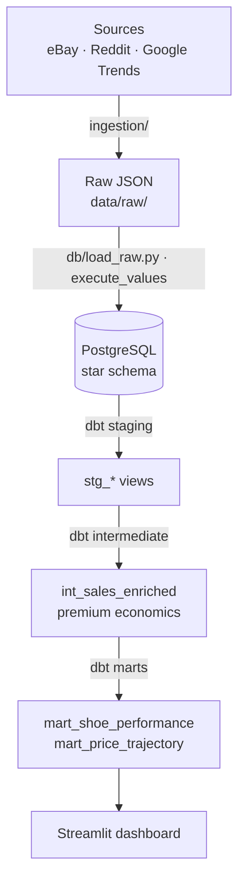

# sneaker-intel

**Sneaker Resale Intelligence Platform** — an end-to-end data engineering project that ingests sneaker resale and demand signals, models them in a warehouse, transforms them with dbt, and surfaces them in a dashboard.

This is a personal portfolio project, built in public. Every phase is documented through Conventional Commits and a running [DEVLOG](DEVLOG.md). Predictive modeling / ML is a deliberate **Phase 2** extension and is intentionally out of scope for this build — the focus here is the data engineering foundation.

**Live demo:** _not yet deployed — see [DEPLOY.md](DEPLOY.md)._ &nbsp;·&nbsp; **CI:** GitHub Actions runs the full pipeline (ingest → load → dbt build + tests) on every push.

## Tech stack

| Layer | Tooling |
|---|---|
| Ingestion | Python (dataclasses, type hints), `requests`, `praw`, `pytrends` |
| Storage | PostgreSQL (hand-written star schema, no ORM), `psycopg2` |
| Transformation | dbt-core + dbt-postgres (staging / intermediate / marts) |
| Dashboard | Streamlit + pandas + SQLAlchemy |
| Deployment | Docker, Makefile, GitHub Actions (CI), Railway / Streamlit Cloud |

## Architecture



## Progress

- [x] **Phase 0** — Project scaffold
- [x] **Phase 1** — Python ingestion layer (eBay / Reddit / Google Trends)
- [x] **Phase 2** — Database schema + raw loader (Postgres star schema)
- [x] **Phase 3** — dbt transformation layer (staging / intermediate / marts + tests)
- [x] **Phase 4** — Streamlit dashboard (Market Overview / Shoe Deep Dive / Drop Calendar)
- [x] **Phase 5** — Deployment & polish (Docker, Makefile, CI, deploy guide, README finalize)

## Run locally

Requires Docker (for Postgres) and Python 3.10+.

```bash
# 1. Environment
python3 -m venv .venv && source .venv/bin/activate   # Windows: .venv\Scripts\activate
pip install -r requirements.txt
cp .env.example .env

# 2. Database
make db-up        # start Postgres 16 (Docker)
make db-init      # apply schema.sql + seeds.sql

# 3. Pipeline
make ingest       # fetch sources -> raw JSON in data/raw/ (stub mode without API keys)
make load         # bulk-load raw JSON into Postgres
make transform    # dbt build: models + data tests

# 4. Dashboard
make dashboard    # Streamlit at http://localhost:8501
```

Run `make help` for all targets. To deploy a live instance, see [DEPLOY.md](DEPLOY.md).

## API credentials

Ingestion runs out of the box in **stub mode** — each source yields synthetic
records so the pipeline is testable before any keys exist. To pull real data,
copy `.env.example` to `.env` and fill in the keys below. Any client whose keys
are missing automatically falls back to stub mode (logged as a warning).

| Source | What to register | Where | Env vars |
|---|---|---|---|
| eBay | Join the eBay Developer Program, create an app, and use its production **App ID (Client ID)** keyset for the Finding API. | https://developer.ebay.com/ | `EBAY_APP_ID` |
| Reddit | Create a **script**-type app to get a client ID + secret. | https://www.reddit.com/prefs/apps | `REDDIT_CLIENT_ID`, `REDDIT_CLIENT_SECRET`, `REDDIT_USER_AGENT` |
| Google Trends | No key required (pytrends scrapes the public endpoint). | — | — |

> Note: eBay is steering new integrations toward the **Browse API**; the Finding
> API still serves sold-listing data but may need migration later. `.env` is
> gitignored — never commit real keys.

## Repo layout

```
sneaker-intel/
├── ingestion/        # source clients + run_ingestion entrypoint
├── db/               # hand-written schema.sql
├── dbt_project/      # dbt models (staging / intermediate / marts)
├── dashboard/        # Streamlit app
├── data/raw/         # landed raw JSON (gitignored)
├── docs/             # erd.md, build-in-public posts
├── tests/            # pytest suite
├── .github/workflows # CI
├── DEVLOG.md         # append-only build log
├── Makefile  Dockerfile  docker-compose.yml  requirements.txt  pyproject.toml
```

## Decisions & tradeoffs

**Star schema, hand-written, no ORM.** The warehouse is read-heavy and
analytical, so a star schema (conformed `dim_shoes` + per-source facts) keeps
analytical queries to a single dimension join and matches what dbt and BI tools
expect. Writing the DDL by hand keeps the constraints and indexes explicit and
interview-explainable. See [docs/erd.md](docs/erd.md).

**Two social fact tables instead of one.** Reddit is per-post and Google Trends
is per-day — different grains. Splitting them (`fact_social_posts`,
`fact_search_interest`) keeps every row meaningful rather than unioning
mismatched grains behind a wall of NULLs.

**Idempotency in the schema, not the loader.** Each fact carries a natural-key
unique constraint and the loader inserts `ON CONFLICT DO NOTHING`, so re-running
ingestion is a safe no-op — the property you want before automating it.

**Window functions over correlated subqueries.** The price-trajectory mart uses
`AVG() OVER` (rolling 7-day premium), `RANK() OVER`, and `LAG()`. These compute
in a single pass over each shoe's partition, where the subquery equivalents
would re-scan per row — clearer and faster.

**A thin dashboard.** Every figure the Streamlit app shows is a query against a
dbt mart, not pandas transformation. Modeling logic stays in dbt where it's
tested; the app only queries and presents.

**Stub mode by default.** Sources without credentials yield deterministic
synthetic records, so the whole pipeline (and the test suite, and CI) runs end
to end before any API keys exist.

**Why no ML yet.** Predictive modeling is a deliberate Phase 2 extension. This
build is scoped to the data engineering foundation — reliable ingestion, a clean
modeled warehouse, tests, and a dashboard — which is the prerequisite any
forecasting work would sit on top of.
