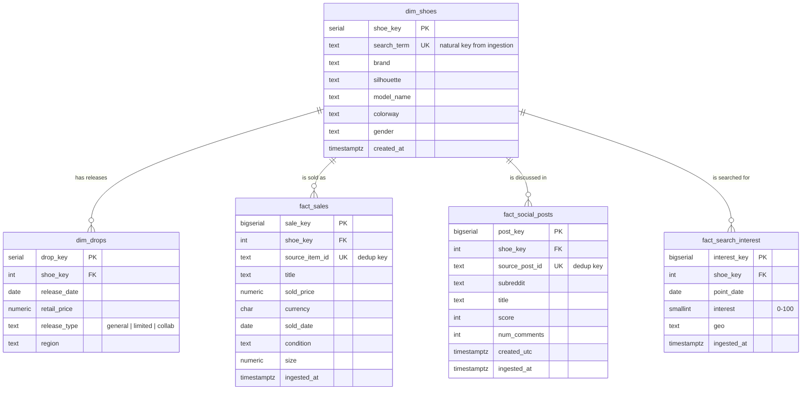

# Entity Relationship Diagram & schema design

The warehouse is a **star schema**: two dimensions describe *what* a shoe is and
*when* it dropped, and three fact tables (one per ingestion source) record
*what happened* (sales, social posts, search interest). Everything joins back to
`dim_shoes`, the conformed dimension.

## Grain (the most important decision)

Each fact table has exactly one, explicitly chosen grain:

| Table | Source | Grain |
|---|---|---|
| `fact_sales` | eBay | one sold listing |
| `fact_social_posts` | Reddit | one post |
| `fact_search_interest` | Google Trends | one shoe per day |

A Reddit post is one event; Google Trends is one row per day, an index rather
than a transaction. Those are genuinely different grains, so forcing them into a
single "social signals" table would mean mixing grains and storing a pile of
nulls. Splitting them keeps every row meaningful and every aggregation honest.
You never accidentally average a post score against a daily interest value.

## Why these choices

**Star schema over a normalized model.** The warehouse is read-heavy and
analytical. The questions are average premium per shoe, demand versus sale
volume over time, which silhouettes hold value. A star schema keeps those to a
single dimension join, and it's the shape dbt and BI tools expect downstream.

**`search_term` as the natural key on `dim_shoes`.** Raw records only know the
term they were ingested under, so it's the reliable join key before any
enrichment. The loader creates a `dim_shoes` row for every new term, and
descriptive attributes are filled in afterward. A surrogate `shoe_key` (serial)
is the foreign key the facts actually carry, so those attributes can change
without touching fact rows.

**Dedup via natural-key unique constraints.** `fact_sales.source_item_id`,
`fact_social_posts.source_post_id`, and `(shoe_key, point_date, geo)` on
`fact_search_interest` each enforce uniqueness. With the loader's
`ON CONFLICT DO NOTHING`, ingestion is idempotent. Resale pulls overlap
constantly, and the same listing landing in two windows never double-counts.

**`dim_drops` as a dimension.** A release is reference data (release date,
retail price, release type) that sales join against to compute days since
release and premium in the dbt layer. The loader derives it from the StockX
dataset, which carries real retail prices and release dates. `release_type` is
constrained to `general`, `limited`, or `collab` so a dbt `accepted_values`
test has something to enforce.

**Indexes.** Every foreign key, plus the time column each fact is filtered and
sorted by (`sold_date`, `created_utc`, `point_date`), is indexed, since the
dashboard and marts slice by shoe and by date window.
