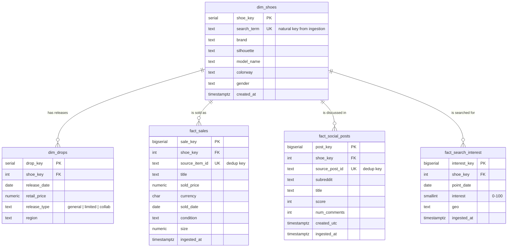

# Entity Relationship Diagram & schema design

The warehouse is a **star schema**: two dimensions describe *what* a shoe is and
*when* it dropped, and three fact tables — one per ingestion source — record
*what happened* (sales, social posts, search interest). Everything joins back to
`dim_shoes`, the conformed dimension.

## Grain (the most important decision)

Each fact table has exactly one, explicitly chosen grain:

| Table | Source | Grain |
|---|---|---|
| `fact_sales` | eBay | one sold listing |
| `fact_social_posts` | Reddit | one post |
| `fact_search_interest` | Google Trends | one shoe per day |

Reddit (per-post) and Trends (per-day) have fundamentally different grains, so
forcing them into a single "social signals" table would mean mixing grains and
storing a pile of NULLs. Splitting them keeps every row meaningful and every
aggregation honest — you never accidentally average a post score against a daily
interest index.

## Why these choices

**Star schema over a normalized model.** This warehouse is read-heavy and
analytical — the questions are "average premium per shoe", "interest vs. sale
volume over time". A star schema keeps those queries to a single dimension join
and is the shape dbt and BI tools expect downstream.

**`search_term` as the natural key on `dim_shoes`.** Raw records only know the
term they were ingested under, so it's the reliable join key before any
enrichment. The loader auto-creates a `dim_shoes` row for every new term;
`seeds.sql` later fills in brand/silhouette/colorway. A surrogate `shoe_key`
(serial) is the actual foreign key the facts carry, so descriptive attributes
can change without touching fact rows.

**Dedup via natural-key unique constraints.** `fact_sales.source_item_id`,
`fact_social_posts.source_post_id`, and `(shoe_key, point_date, geo)` on
`fact_search_interest` each enforce uniqueness. Combined with the loader's
`ON CONFLICT DO NOTHING`, ingestion is idempotent — overlapping pulls of the
same listing/post/day never double-count.

**`dim_drops` as a dimension.** A release is reference data (release date,
retail price, release type) that sales join against to compute days-since-release
and resale premium in the dbt layer. It's seeded by hand for now because no drops
source is ingested yet; `release_type` is constrained to `general | limited |
collab` so a dbt `accepted_values` test has something to enforce in Phase 3.

**Indexes.** Every foreign key plus the time column each fact is filtered/sorted
by (`sold_date`, `created_utc`, `point_date`) is indexed, since the dashboard and
marts slice by shoe and by date window.
